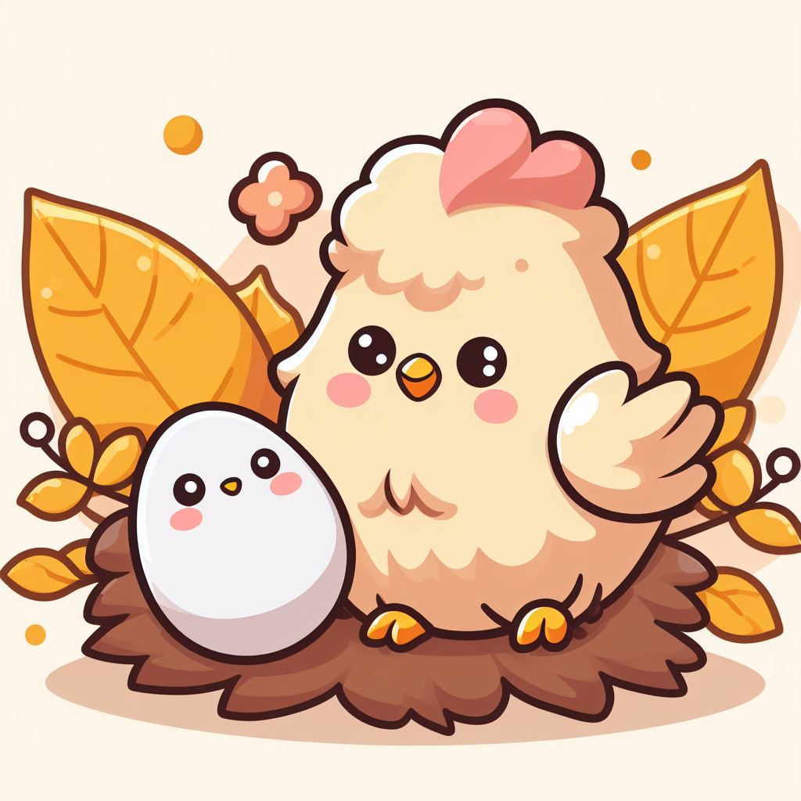

Chickens are extraordinary companions, not only for those who enjoy their delightful company but also for the many benefits they bring to our lives. In this post, we'll delve into the wonderful world of chickens as pets and their valuable contributions to our gardens and sustainable living.

## Chickens as Feathered Companions

Chickens make wonderful pets for those seeking a unique and endearing animal to share their lives with. Their friendly and curious nature, combined with their charming personalities, endears them to many[^1]. Chickens have a remarkable ability to connect with their human caregivers, often forming strong bonds. They can even be taught to come when called and may enjoy being held or petted.

## Garden Allies and Natural Fertilizers

Beyond their role as pets, chickens are exceptional garden allies. They can be an integral part of a sustainable and eco-friendly gardening approach. Chickens provide numerous benefits to the garden:

| Benefit             | Contribution                     |
|---------------------|----------------------------------|
| Pest Control        | Natural insect and weed control  |
| Fertilizer          | Producing nutrient-rich manure    |
| Soil Aeration       | Scratching and loosening the soil |
| Composting Helpers  | Breaking down organic matter     |

Chickens are voracious foragers, hunting insects and eating weeds, reducing the need for chemical pesticides and herbicides. Their scratching and pecking in the soil help aerate it and promote healthier plant growth. Chicken manure is an excellent, natural fertilizer that enriches the soil with essential nutrients.

## Sustainability and Chicken Keeping

Sustainable living is increasingly vital in our world, and keeping chickens is a part of this eco-conscious lifestyle. Chickens help reduce kitchen waste by consuming kitchen scraps and leftovers. Their manure contributes to healthier gardens and decreases the need for synthetic fertilizers.

## The Fascinating Behavior of Chickens

Chickens are not just pets; they are also captivating animals with intricate behaviors. They have their social hierarchy, and each chicken in a flock has its personality and quirks. Observing a flock of chickens can be a mesmerizing experience as they interact with one another, forage, and exhibit their unique personalities.

## Conclusion

Chickens are extraordinary pets and invaluable allies in sustainable living. They offer companionship, enrich our gardens with natural fertilizers, and contribute to a more eco-friendly and self-sustaining lifestyle. So, the next time you encounter a contented backyard chicken or enjoy a garden nurtured by their presence, remember to appreciate the marvelous world of chickens.

> "Chickens make exceptional pets and garden companions, enriching our lives in countless ways."
>
> — Jane R. Peterson, *Chickens as Pets and Garden Allies*

[^1]: Some reference goes here
